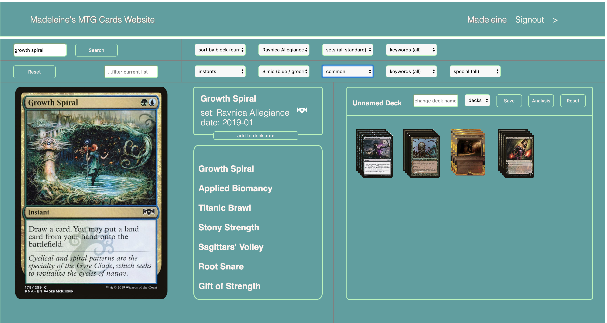

### Madeleine's MTG React-Redux-Node-Mongo Cards Website

https://radiant-stream-78248.herokuapp.com/

(This picture is an older version. Current app has more features...)

Although appearing simple, this app was built with many technologies, including react, redux to manage state (including async middlewares for api calls), react-router, higher order components, good re-rendering functionality(local state is saved in browser), css modules for styling, node/express server with routing, mongo database, passport and jwt for authorization/user signin, modern es6 syntax, and heroku build & deployment with separate client and server. It utilizes a database of over 40,000 Magic the Gathering cards from the Scryfall database. Rather than call the Scryfall api directly, I opt to download their bulk data regularly and have built my own API with a node back end that serves the data. In order to do this I have another library of node.js files ( see https://github.com/madeleinehuish/magic_util ) where I process the data and build/create files that are used in my own Magic API. I have also scraped some data from other pages with permission of the site owners and added to the original data.  The app allows for easy filtering of the current sets (last 6) as well as filtering individual sets going all the way back to Magic's beginnings in the early 90s. I have also created a massive block filtering system so that one can sort standard blocks according to year. There are more plans for filtering options which I will implement as soon as possible. I'm also still working on implementing lists, deck-building and saving options for the user accounts. Some of these features are available but you'll notice in the production app that the deckbuilding is not fully working yet.

After signing in or signing up, the app will take you to a page where you can filter through the Magic cards and sort them in many different ways. Exploring the app might reveal another fun location :) (hint: try the carrot...)

Note: The top row of select boxes is for searching across the entire database and the lower row is for filters. There are 2 keywords filters in the app. The top filter filters across the entire database of over 40k cards and the lower filter filters across what is currently selected.

This is a current work in progress as of mid-April 2019.

(update late March: I have added search functionality across the full database and updated some of the filtering of which some is now handled from the backend. It is still a work in progress. Not all sections, especially the deckbuilding are working fully yet. I've slowed down on the deckbuilding part to work with other areas of the app and develop the handling of the filtering better. I'm also still working out the best way to represent the UI. As of now it is purely functional.)

(update mid April: Still waiting on the deckbuilding part of this app. I have changed my idea of what I want to implement there... I have fixed the double sided cards, cleaned up some functionality, fixed broken image pathways, corrected some of the filtering logic with blocks, as well as added keyword search functionality for the main db, among other things. I have many many ideas of more functionality and ui fixes that I want to implement as soon as I find time. :) )
